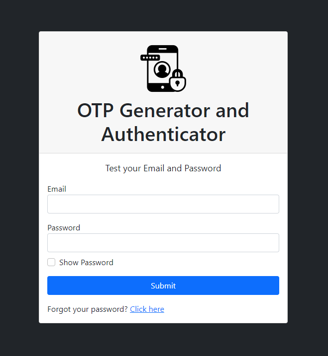

# OTP Generator and Authenticator



Welcome to the OTP Generator and Authenticator project! This project aims to provide a simple and efficient way to generate and authenticate one-time passwords (OTPs). Whether you're securing user logins, transactions, or any other sensitive operation, this application can help enhance security with OTP functionality.

## Installation

To run this project locally, you will need to set up XAMPP, a free and open-source cross-platform web server solution stack package developed by Apache Friends. XAMPP provides an environment suitable for PHP development. Follow these steps to install and run the project:

1. **Download XAMPP**: Download and install XAMPP from the [official website](https://www.apachefriends.org/index.html).

2. **Clone the Repository**: Clone this repository to your local machine using Git:
```
git clone https://github.com/MarkChito/OTP-Gererator-and-Authenticator.git
```

3. **Move Files**: Move the cloned repository to the `htdocs` directory of your XAMPP installation. This directory is typically located at `C:\xampp\htdocs` on Windows or `/Applications/XAMPP/htdocs` on macOS.

4. **Start XAMPP**: Open XAMPP Control Panel and start the Apache server.

5. **Database Setup**: The system will automatically generate the database and table schemas, as well as sample data. However, you must manually update the email addresses in the "email" section of the "users" table to reflect valid email addresses. You can do this using phpMyAdmin, which is included with XAMPP.

6. **Access the Application**: Open your web browser and navigate to `http://localhost/OTP-Generator-and-Authenticator` to access the application.

## Features

- **OTP Generation**: Generate one-time passwords for secure authentication.
- **OTP Authentication**: Authenticate users using one-time passwords.
- **User Management**: Manage users with basic CRUD operations.
- **Session Management**: Maintain user sessions securely.

## Technologies Used

- **PHP**: Backend scripting language.
- **MySQL**: Relational database management system.
- **HTML/CSS**: Frontend design and structure.
- **Bootstrap**: Frontend framework for responsive design.
- **JavaScript**: Client-side scripting for interactivity.

## Contributing

Contributions are welcome! If you'd like to contribute to this project, feel free to fork the repository and submit a pull request with your changes.

## License

This project is licensed under the MIT License - see the [LICENSE](LICENSE) file for details.

## Acknowledgments

- Special thanks to [Apache Friends](https://www.apachefriends.org/index.html) for providing XAMPP.
- Inspiration for this project came from the need for secure authentication in web applications.

Thank you for your interest in OTP Generator and Authenticator! If you have any questions or feedback, please feel free to reach out.